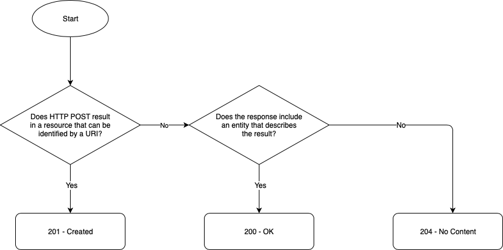

# Error Handling

Handling errors is a very important part in designing and building your API.

Using the proper HTTP status codes and clear messages to indicate errors will make your APIs easy to consume and easy to understand.

## HTTP Status Codes

Industry best practices:
- Use well-known status codes.
- Limit the number of different status codes.
- Wrap "non-standard" status codes into standard status codes.

| Internal | Private | Partner | Open |
| --- | --- | --- | --- |
| Must | Must | Must | Must |

### Success

| HTTP Status Code | Formal Description | When to Use |
| --- | --- | --- |
| 200 | OK | Request successful. Response depends on the request method used that is, GET, POST, and so on. |
| 201 | Created | Request fulfilled. Resource created. The HTTP response should contain a **Location** HTTP header containing the URL of the newly created resource. |
| 202 | Accepted | Request queued (typically for DELETE operations). Can be used to inform the consumer that the request has been received, but will be fulfilled at a later time. |
| 204 | No Content | Request successful. Response does not contain a body. Can be used to avoid sending back the full resource following a successful PUT request when it is a large payload. |

### Redirection

| HTTP Status Code | Formal Description | When to Use |
| --- | --- | --- |
| 301 | Moved Permanently | Permanent URL redirection that is, the resource has been definitively moved to the new URL. The URL used to access the resource must be updated with the value received in the **Location** HTTP header. By updating the URL to access the resource (at the client side), you ensure that any subsequent access to the resource will save one round-trip time (by avoiding the redirection). The HTTP method and HTTP body should not be altered when the redirection is performed. |
| 302 | Found | Also called Moved Temporarily. The URL in the **Location** HTTP header should be followed by the client but not used to update the original URL to the resource (the redirection is only temporary). The HTTP method and HTTP body should not be altered when the redirection is performed. |
| 303 | See Other | Resource is too large to be returned as one response. The response should be paginated. The HTTP response should contain a **Location** HTTP header containing the URL of the first page that is, specified with the **limit** and **offset** query parameters. |
| 304 | Not Modified | Resource not modified since version specified in **If-Modified-Since** or **If-None-Match**. No resource retransmit. Redirect to client-cached resource. |

### Client Errors

| HTTP Status Code | Formal Description | When to Use |
| --- | --- | --- |
| 400 | Bad Request | Client error in request (for example, malformed request syntax). The client should not repeat the request without modifications. Some possible actions to [fix this error](https://www.lifewire.com/how-to-fix-a-400-bad-request-error-2617988) are: check for errors in the URL, clear cookies storage, clear DNS cache, or clear web browser cache. |
| 401 | Unauthorized | Semantically means unauthenticated that is, involving authentication or proof of identity. The response must include a **WWW-Authenticate** header field containing a challenge applicable to the requested resource. To be used when authentication is required but has failed or has not yet been provided that is, missing **Authorization** header. After receiving an HTTP 401, the client should send back an HTTP request containing an **Authorization** header. |
| 403 | Forbidden | Semantically means unauthorized that is, involving authorization or proof of access right. The request is valid, but the server is refusing action because the user either does not have necessary permissions for the resource or needs an account. At this point, the access is permanently forbidden and an action is required before the client can resend the request to this URL. |
| 404 | Not Found | Requested resource cannot be found, but may be available in the future. Subsequent requests from client are permissible. |
| 405 | Method Not Allowed |HTTP verb used to access this resource is either not supported by the provider or not authorised for the consumer. If the method requested is not allowed for the authenticated consumer, it is best to send an HTTP 405 that is, partial access to resource is forbidden. If the access to the URL is not allowed for the authenticated consumer, it is best to send an HTTP 403 that is, full access to the resource is forbidden. Response must include an **Allow** header field containing the list of methods/verbs supported by the target resource for the authenticated consumer.  |
| 406 | Not Acceptable | Server cannot produce a response that is, the representation of the requested resource matching the list of media types accepted by the client. Clients indicate the list of accepted media types in the **Accept** HTTP request header field (for example, Accept: application/json, application/xml). |
| 407 | Proxy Authentication Required | Request has not been applied because it lacks valid authentication credentials for a proxy server that is between the client and the server that can access the requested resource. Response must include a **Proxy-Authenticate** header field containing information on how to authorise correctly. |
| 409 | Conflict | Request cannot be completed due to a conflict with the current state of the target resource. Conflicts usually occur in response to PUT requests when multiple users are trying to update the same resource at the same time that is, [optimistic locking](https://en.wikipedia.org/wiki/Optimistic_concurrency_control). This status code can also be used to indicate that a new resource that we are trying to create already exists (for example, trying to create a new account with an email address that is already registered). |
| 410 | Gone | Access to the target resource is no longer available at the origin server because it has been permanently deleted. Because the deletion of the resource is permanent, subsequent requests from a client are not allowed. A 404  status code must be used instead if you do not know whether the condition is temporary or permanent. |
| 413 | Payload Too Large |Indicates the server or gateway is refusing to process your request because the request payload is larger than willing or able to process. By default, the API gateway supports up to [10 MB](https://docs.apigee.com/api-platform/fundamentals/best-practices-api-proxy-design-and-development#size). |
| 429 | Too Many Requests | Indicates that the user has sent too many requests in a given amount of time. The HTTP response should contain the Retry-After HTTP header with the estimated time before making a new request. Used to [prevent DDoS attacks and for API rate limiting](https://docs.apigee.com/api-platform/develop/comparing-quota-spike-arrest-and-concurrent-rate-limit-policies.html). |

### Server Errors

| HTTP Status Code | Formal Description | When to Use |
| --- | --- | --- |
| 500 | Internal Server Error | Generic server error message. |
| 503 | Service Unavailable | Server is not ready to handle the request, either because it is down for maintenance or because it is overloaded. The HTTP response should contain the **Retry-After** HTTP header with the estimated time for the recovery of the service. |
| 504 | Gateway Timeout | Indicates that a server, acting as a proxy/gateway, did not receive a response from the main server within a set time period. |

### 200-OK versus 201-Created versus 204-No Content

From [RFC2616 section 9.5](https://www.w3.org/Protocols/rfc2616/rfc2616-sec9.html#sec9.5).

The action performed by the POST method might not result in a resource that can be identified by a URL.
In this case, either 200 (OK) or 204 (No Content) is the appropriate response status, depending on whether or not the response includes an entity that describes the result.
If a resource has been created on the origin server, the response SHOULD be 201 (Created) and contain an entity which describes the status of the request and refers to the new resource, and a Location header.



*200 versus 201 versus 204*

## Error Messages

In case of error, every API should return a clear descriptive error message in the response body.

```text
Convention: 	In case of error, always use the standard error message structure in the response body.

Example(s): 	HTTP Status Code (4xx or 5xx)
                Error Message (in JSON format):
                {
                    "code": "SwAP5xx",
                    "severity": "Fatal",
                    "text": "Verbose, human-readable description of the problem for the application developer with hints about how to fix it.",
                    "user_message": "Message to be passed to the application user, if needed.",
                    "more_info": "https://developer.swift.com/errors/SwAP/5xx"
                }
```

| Field | Mandatory | Description |
| --- | --- | --- |
| code | Yes | Unique identifier for errors. Should contain an indication of which system/application/component/sub-component is throwing the error. |
| severity | Yes | Severity of the error. Either Fatal, Transient or Logic. |
| text | Yes | Textual description of the error. |
| user_message | No | Can contain a message to be passed to the application user. |
| more_info | No | Can contain a URL to more information about the error. |

The **code** field:
- Can be used to identify either an API gateway error or an application-specific error.
- Does not replace the HTTP status code.

JSON Schema for the Error Message Structure:

```json
    {
        "$schema": "https://json-schema.org/draft-07/schema#",
        "$id": "https://developer.swift.com/error-message.schema.json",
        "title": "Error Message",
        "description": "An error message returned by either the API gateway or the API backend server.",
        "type": "object",
        "properties": {
            "code": {
                "type": "string",
                "description": "The unique identifier of the error. It should contain an indication of which system/application/component/sub-component is throwing the error."
            },
            "severity": {
                "type": "string",
                "enum": ["Fatal", "Transient", "Logic"],
                "description": "The severity of the error."
            },
            "text": {
                "type": "string",
                "description": "The verbose human-readable description of the problem for the application developer with hints about how to fix it."
            },
            "user_message": {
                "type": "string",
                "description": "The message to be passed to the application user, if needed."
            },
            "more_info": {
                "type": "string",
                "description": "The URL link to more information about the error (for example, https://developer.swift.com/errors/SwAP/12345)."
            }
        },
        "required": ["code", "severity", "text"]
    }
```

The HTTP status code only does not provide enough information to determine if the error is related to the API Gateway or one of the back-end services behind it.

Each error code should ideally have an associated web page that is, the URL in the more_info field of the error message describing the problem and giving suggestions on how to solve it.

Never ever return stack traces, because they may contain sensitive information about the back-end service.

| Internal | Private | Partner | Open |
| --- | --- | --- | --- |
| Could | Must | Should | Must |

## API Gateway Errors

The table below contains the error codes returned by the old SwAP API Gateway.

They will be removed in the future, when SWIFT will only use the new APIGEE API Gateway.

| Error Code | Error Severity | Error Text | HTTP Status Code |
| --- | --- | --- | --- |
| SwAP001 | Fatal | API Service not provisioned  | 401 Unauthorized |
| SwAP002 | Fatal | Invalid OAuth Token | 401 Unauthorized |
| SwAP003 | Fatal | OAuth access token has insufficient scope for the requested service | 401 Unauthorized |
| SwAP008 | Fatal | Invalid response received from Service Provider | 502 Bad Gateway |

The table below contains the error codes returned by the new APIGEE API Gateway.

All error codes starting with SwAP5xx are coming the new APIGEE API Gateway.

| Error Code | Error Severity | Error Text | HTTP Status Code |
| --- | --- | --- | --- |
| SwAP501 | Fatal | APIRequestIsMalformed | 400 Bad Request |
| SwAP502 | Fatal | InvalidOAuthToken | 401 Unauthorized |
| SwAP503 | Fatal | OAuthTokenHasInsufficientScopeForRequestedService | 403 Forbidden |
| SwAP504 | Fatal | RequestBodyIsNotWellFormed | 400 Bad Request |
| SwAP506 | Fatal | ResourceDoesNotExist | 404 Not Found |
| SwAP507 | Transient | RequestCannotBeProcessedAtThisTime | 429 Too Many Requests |
| SwAP508 | Fatal | OAuthTokenNotProvided | 401 Unauthorized |
| SwAP509 | Fatal | Missing mandatory signature on the non-repudiation API transaction | 400 Bad Request |
| SwAP510 | Fatal | The API method does not support non-repudiation | 400 Bad Request |
| SwAP521 | Fatal | XBICHeaderNotIncluded | 400 Bad Request |
| SwAP522 | Fatal | XBICHeaderNotValid | 400 Bad Request |
| SwAP590 | Transient | ServiceTemporarilyUnavailable | 503 Service Unavailable |
| SwAP591 | Transient | ServiceProviderTimeOut | 504 Gateway Timeout |
| SwAP599 | Fatal | UnexpectedError | 500 Internal Server Error |

## Back-end Errors

Each back-end service must provide a full list of clearly defined error codes with associated web pages describing the error and how to solve it.

Each error from back-end services must follow the structure defined in paragraph 9.2 Error Messages.

This is a strong requirement for any existing and new API.

```text
Convention: 	Back-end services must follow the Error Message structure defined in paragraph 9.2 Error Messages.
```

```text
Convention: 	Back-end services must provide their full/complete list of error codes.
```
