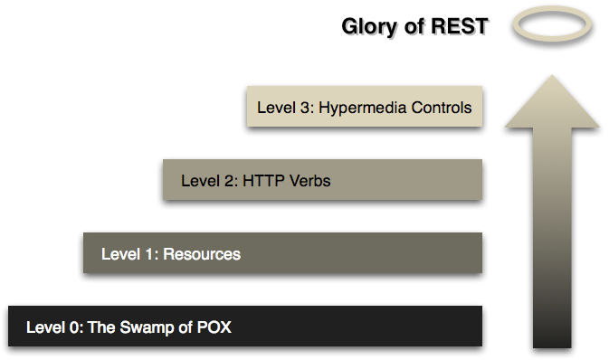

# HTTP Verbs

HTTP verbs are a set of methods that can be used to perform actions on a resource identified by its URL.

You send them along with the request to tell the server what you want to do.

## Maturity Level

In the [Richardson Maturity Model](https://martinfowler.com/articles/richardsonMaturityModel.html), the **Level 2 - HTTP Verbs** is the minimum maturity level for all SWIFT APIs.

At this level, the HTTP protocol is no longer used as only a transport/tunneling mechanism, but the HTTP verbs define the actions on the resources (for example, use GET when reading a resource, and use POST when creating a resource, and so on).



*Richardson Maturity Model (RMM)*

### Level 0: The Swamp of Plain Old XML (POX)

This is a straightforward RPC-style system in which XML is sent back and forth.

This is similar to SOAP and XML-RPC, with the only difference that XML messages are wrapped into an HTTP "envelope".

**Only using HTTP POST and rarely HTTP GET that is, HTTP is only a transport mechanism.**

### Level 1: Resources

*Use Divide and Conquer to handle complexity by breaking one large service endpoint down into multiple resources.*

Stop making all requests to one singular service endpoint, but start "talking" to individual resources.

Each item in the response is a resource that can be addressed individually by its URL.

Resources should always be **NOUNS** (for example, /users or /payment-status) and never contain **VERBS** (for example, /getUsers or /setBIC).

There are sometimes exceptions to this rule, and VERBS may be used if they make the API's intent clearer (for example, /swift-translation-api/v1/translate instead of /swift-translation-api/v1/translation-result).

Resources uniquely identified by their URLs are similar to Objects uniquely identified by their Object Identities.

**Only using HTTP POST and rarely HTTP GET that is, HTTP is only a transport mechanism.**

### Level 2: HTTP Verbs

*Remove Unnecessary Variation by using a standard set of verbs to handle similar situations in the same way.*

Move away from the "HTTP as a transport mechanism only" and use HTTP verbs as closely as possible to how they are used in HTTP.

HTTP verbs have a strong semantic. Following is an example for the GET HTTP verb:
- GET is for reading a resource.
- GET is a safe operation that is, it does not change the state of anything.
- GET is idempotent that is, it can be called any number of times in any order and you get the same results each time.
- Because of the two preceding properties that is, safe and idempotent, GET results can be cached by any participant to reduce latency and bandwidth consumption.

This level enforces following the rules of HTTP, to take full advantage of its capabilities.

This level also makes extensive use of HTTP response/status codes to inform the client of the outcome of the HTTP request that is, either success or error.

**Enforce the use of HTTP verbs and HTTP response/status codes.**

### Level 3: Hypermedia Controls

*Introduce Discoverability by providing a way to make the APIs "self-documenting".*

Hypermedia As The Engine Of Application State (HATEOAS).

Each resource in the response must have an element property containing its URL.

Rather than you having to know where to go next, the hypermedia controls in the response tell you what you can do next that is, the response contains links to what may be possible next.

These hyperlinks in the responses can also be used as a way to advertise new capabilities offered by the APIs.

Good practice is to follow the ATOM ([RFC 4287](https://tools.ietf.org/html/rfc4287)) specification for hyperlinks in responses that is, using a link element with a uri attribute to the target URL and a rel attribute to describe the kind of relationship.

**Enforce the use of HTTP verbs and HTTP response/status codes, and include URLs for each resource in the response to tell consumers what to do/where to go next.**

### REST Uniform Interface

The REST uniform interface is based on three fundamental elements:
- Resources: Any resource is uniquely identified by a Uniform Resource Locator (URL).
- HTTP Methods/Verbs: POST, GET/HEAD, PUT/PATCH or DELETE.
- Media Types: HTTP supports content negotiation for media types of the response that is, the representation of the requested resource.

```text
Convention: 	SWIFT APIs must have at least a maturity of "Level 2: HTTP Verbs" in the Richardson Maturity Model.
                At this level, the HTTP protocol is no longer used as only a transport/tunneling mechanism, but the HTTP verbs define the actions on the resources.
```

| Internal | Private | Partner | Open |
| --- | --- | --- | --- |
| Must | Must | Must | Must |

## CRUD

CRUD stands for:
- **Create** to create a new element in a collection of elements.
- **Read** to read/retrieve an element from a collection of elements.
- **Update** to update (fully or partially) an element in a collection of elements.
- **Delete** to remove an element from a collection of elements.

CRUD defines the four basic operations for managing a collection of elements/resources/data.

Some HTTP verbs enable you to send a body along with your request.

The body contains extra information that might be required to perform a certain action.

A POST request, for example contains a body that gives the server information on what entity to create.

The below table describes the most frequently used HTTP verbs:

| HTTP Verb | Operation | Description | Request Body? | SQL | Safe | Idempotent |
| --- | --- | --- | --- | --- | --- | --- |
| POST | Create | Create a new resource | Yes | INSERT | No | No |
| GET | Read | Retrieve an existing resource | No | SELECT | Yes | Yes |
| HEAD | Read Headers | Retrieve headers of an existing resource | No | SELECT | Yes | Yes |
| PUT | Full Update | Fully update an existing resource (optionally create a new resource if it does not exist) | Yes | UPDATE | No | Yes |
| PATCH | Partial Update | Partially update an existing resource | Yes | UPDATE | No | No |
| DELETE | Delete | Delete an existing resource | No | DELETE | No | Yes |

*Do not use an HTTP verb to perform an action that does not correspond to the verb. For example, do not use a POST request to only retrieve (GET) data.*

### Safe Methods

An HTTP verb/method is safe if it does not alter the state of the server that is, if the operation is read-only.

### Idempotent Methods

An HTTP verb/method is idempotent if it can be invoked multiple times without changing the result beyond the initial application.

### POST

POST can either create a new resource or update (full update) an existing one.

PUT is preferred to update (full update) an existing resource, because it is idempotent.

When a resource has been successfully created through HTTP POST, an HTTP 201 Created status code should be returned with a Location HTTP response header containing the URL to the newly created resource.

The URL in the Location header should always be absolute, to make it easier to consume by client applications.

#### HTTP POST to send data for handling without necessarily creating a new resource

From [Hypertext Transfer Protocol -- HTTP/1.1](https://www.w3.org/Protocols/rfc2616/rfc2616-sec9.html):

```text
The action performed by the POST method might not result in a resource that can be identified by a URI.
In this case, either 200 (OK) or 204 (No Content) is the appropriate response status, depending on whether or not the response includes an entity that describes the result.
If a resource has been created on the origin server, the response should be 201 (Created) and contain a Location header.
```

Strictly speaking, using POST to send data without creating a new resource is not RESTful. The [uniform interface](https://www.gcloud.belgium.be/rest/#uniform-interface) constraint of REST imposes the POST method to create a new resource.

However, when sending a request with many parameters, you sometimes do not have the possibility to put the whole parameters in the URL, because URLs should be limited to 2000 characters.

In this situation, using POST is the only possible solution, provided that the status code returned by the API is either 200 (OK) or 204 (No Content), as described above.

Forcing the use of HTTP POST instead of HTTP GET for security reasons (for example, to avoid passing sensitive information in the URL) is [not a valid argument](https://confluence.swift.com:8443/pages/viewpage.action?pageId=125511102).

If you need to read/get a resource, you should use HTTP GET that is, adhere to the REST principles and pass any sensitive information in HTTP headers to ensure they remain protected.

Passing sensitive information in the URL is not recommended because URLs can be bookmarked and stored in log files of web servers and intermediate proxies.

### GET

GET retrieves a representation of the resource identified by its URL in one of the formats listed in the Accept request header (for example, application/json).

GET becomes *conditional* if it contains at least one of the following request headers:
- **If-Modified-Since** will transfer the resource only if it has been last modified after the given date.
- **If-Unmodified-Since** will transfer the resource only if it has not been last modified after the given date.
- **If-Match** will transfer the resource only if it matches one of the listed ETags.
- **If-None-Match** will transfer the resource only if it does not match one of the listed ETags.

*An ETag (Entity Tag) is an identifier for a specific version of a resource that is, it is similar to a hash or a fingerprint of a resource.*

GET becomes *partial* if it contains a **Range** request header which returns only the part(s) of a resource specified by the value in the **Range** request header.

Responses to GET requests can be cached.

### 7.2.3. PUT/PATCH

PUT can either create a new resource or update (full update) an existing one.

PUT is idempotent.

Idempotency is the main difference between PUT versus POST requests.

Because PUT replaces an existing resource, if only a subset of data is provided, the rest will be replaced with empty/null.

Replacing the whole resource is the main difference between PUT versus PATCH requests.

PATCH only updates (partial update) the specified fields of a resource.

PATCH is not safe, because it alters the state of the server that is, a read-write operation.

PATCH is not idempotent, because invoking it multiple times may change the result beyond the initial application.

#### Concrete example of a NON idempotent PATCH request

This example uses [JSON PATCH](http://jsonpatch.com/).

JSON Patch is a format for describing changes to a JSON document. When used in combination with the HTTP PATCH method, it enables partial updates for HTTP APIs in a standards-compliant way.

JSON Patch defines several operations that is, Add, Remove, Replace, Copy, Move and Test.

Consider a Resource whose JSON Representation is:

```json
    {
      "products": [
        { "name": "iPhone" },
        { "name": "iPad" }
      ]
    }
```

Now, consider the following Add Operation:

```json
   {
     "op": "add",
     "path": "/products/1",
     "value": {
       "name": "Apple Watch"
     }
   }
```

This operation will insert the object:

```json
    {
      "name": "Apple Watch"
    }
```

Before the index 1 in the products array.
The JSON Representation of the Resource is now:

```json
    {
      "products": [
        { "name": "iPhone" },
        { "name": "Apple Watch" },
        { "name": "iPad" }
      ]
    }
```

If we send the same HTTP PATCH request again, the JSON Representation of the Resource would now be:

```json
    {
      "products": [
        { "name": "iPhone" },
        { "name": "Apple Watch" },
        { "name": "Apple Watch" },
        { "name": "iPad" }
      ]
    }
```

This example clearly shows that PATCH is NOT idempotent.

### DELETE

DELETE removes the resource identified by its URL.

The resource does not have to be removed immediately that is, it could be an asynchronous or long-running process.
